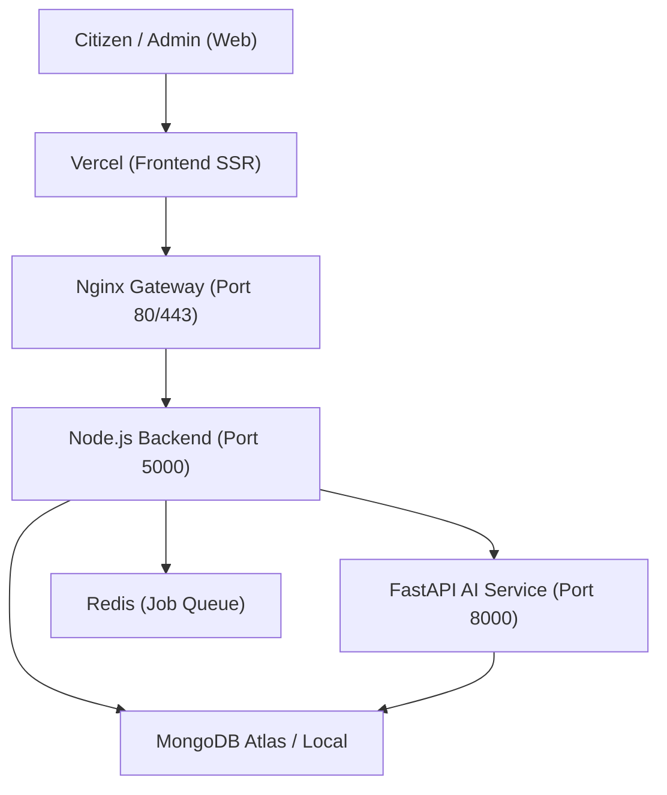

# 🛰️ Bharat JanSetu - Production Deployment Blueprint

This document provides the authoritative, step-by-step procedure for deploying the **Bharat JanSetu** ecosystem into a production-hardened environment.

---

## 🏗️ 1. System Architecture

The project follows a distributed microservices pattern orchestrated via Docker.



---

## 📋 2. Prerequisites & Environment Matrix

### Infrastructure Requirements
- **Server**: Linux (Ubuntu 22.04+ recommended), 4GB RAM minimum (for spaCy ML).
- **Storage**: Cloudinary Cloud Storage (with local disk fallback).
- **Database**: MongoDB Atlas (recommended) or Dockerized Mongo.
- **Tools**: Docker & Docker Compose v2+.

### Environment Variable Matrix (`.env`)

| Component | Variable | Purpose |
| :--- | :--- | :--- |
| **Backend** | `MONGO_URI` | MongoDB Connection String |
| **Backend** | `JWT_SECRET` | Secure key for authentication |
| **Backend** | `AI_SERVICE_URL` | Internal Docker URL: `http://ai-service:8000` |
| **Backend** | `REDIS_HOST` | Internal Docker URL: `redis` |
| **Backend** | `CLOUDINARY_CLOUD_NAME` | Cloudinary Cloud Name |
| **Backend** | `CLOUDINARY_API_KEY` | Cloudinary API Key |
| **Backend** | `CLOUDINARY_API_SECRET` | Cloudinary API Secret |
| **Frontend** | `NEXT_PUBLIC_API_URL` | Public URL of the Nginx Gateway |

---

## 🚀 3. Step-by-Step Deployment

### Phase 1: Infrastructure Setup
1.  **Clone the Repository**:
    ```bash
    git clone https://github.com/mudit2838/jan-set-ai.git
    cd jan-set-ai
    ```
2.  **Configure Environment**:
    Create a `.env` file in the `backend/` directory referencing `backend/.env.example`.

### Phase 2: Docker Orchestration
1.  **Build and Launch**:
    ```bash
    docker-compose up --build -d
    ```
    > [!IMPORTANT]
    > The build step includes downloading the `en_core_web_md` spaCy model (~40MB). Ensure the server has internet access during the build.

2.  **Verify Services**:
    ```bash
    docker-compose ps
    ```
    Ensure `jansetu_backend`, `jansetu_ai`, `jansetu_database`, and `jansetu_gateway` are all `healthy`.

### Phase 3: Data Seeding
1.  **Initialize Jurisdictions**:
    Run the production seeding script to populate UP districts and blocks:
    ```bash
    docker exec -it jansetu_backend node seedProduction.js
    ```

### Phase 4: Frontend Deployment (Vercel)
1.  Connect your GitHub repository to **Vercel**.
2.  Set the Framework Preset to **Next.js**.
3.  Set the Root Directory to `frontend/`.
4.  Add `NEXT_PUBLIC_API_URL` (points to your server IP or domain).

---

## 🔐 4. Production Hardening & SSL

To enable HTTPS, use **Certbot** with the Nginx container:

1.  **Update `nginx.conf`**: Point `server_name` to your actual domain.
2.  **Run Certbot**:
    ```bash
    sudo apt install certbot
    sudo certbot certonly --manual -d yourdomain.com
    ```
3.  **Map Certificates**: Update `docker-compose.yml` to mount the letsencrypt volume to the Nginx container.

---

## ✅ 5. Post-Deployment Verification

Run the following smoke test to ensure 100% precision AI and routing are active:

```bash
# Test AI Microservice Health
curl http://your-server-ip:8000/health

# Test Backend API
curl http://your-server-ip/api/health
```

---

*Prepared by Antigravity AI | Version 1.1*
